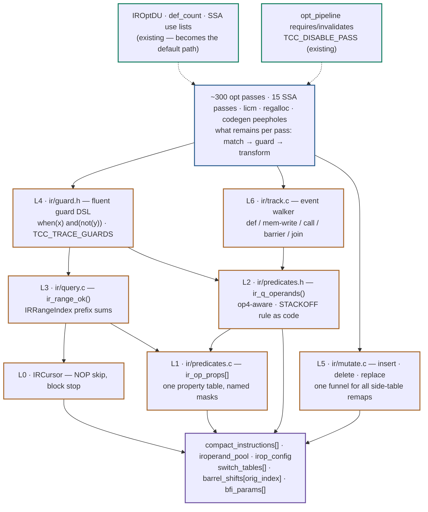
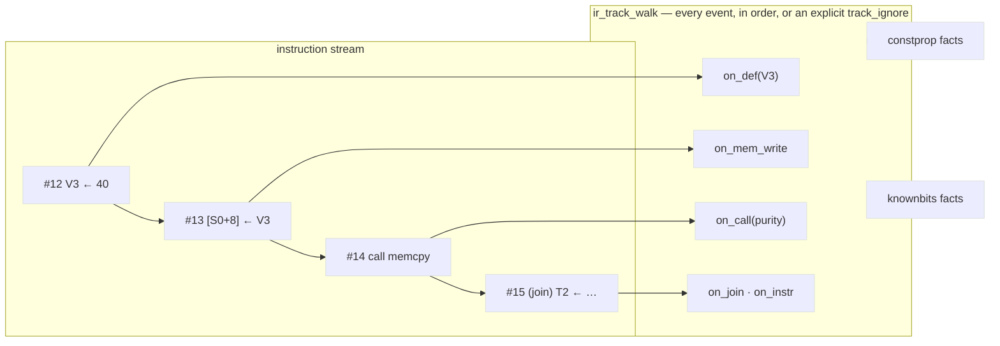

# Guards, not folklore — a predicate & query framework for the IR optimizer

> tinycc · armv8-m fork · optimizer proposal · 2026-07-03
>
> Styled version with full diagrams: [plan_opt_predicate_framework.html](plan_opt_predicate_framework.html)
> (self-contained, open in a browser). This Markdown is the diff-friendly source of truth;
> Mermaid diagrams render on GitHub and in VS Code preview.

Optimization passes are filters and selectors: scan instructions, check conditions,
rewrite. Nearly every fuzzer miscompile fixed in this fork was one **missing guard
condition** — a check that a sibling pass had already learned the hard way. This plan
turns guards from per-pass folklore into a shared, named, composable, *observable*
vocabulary — one op-property table, one operand iterator, one range engine, one fluent
guard DSL, one mutation funnel, one invalidation walker — so each class of fix lands
once, centrally, forever.

| | |
|---|---|
| `tcc_ir_opt_*` functions | ~300, plus 15 SSA passes |
| `op == TCCIR_OP_*` comparisons | 1,962 |
| whole-function scan loops | ~75 |
| range-scan predicates | ~35 (only 2 use prefix sums) |
| `is_jump_target` guard sites | 220 |
| `operand_base+3` (op4) sites | 110 |
| invalidation sites in 6 tracking passes | ~82 |
| fuzz fixes that were missing guards | 10+ named regression tests |

## Contents

1. [The anatomy of a miscompile](#1-the-anatomy-of-a-miscompile)
2. [The shapes of optimizer code today](#2-the-shapes-of-optimizer-code-today)
3. [Design overview](#3-design-overview--seven-layers-one-vocabulary)
4. [L1 — one op-property table](#4-l1--one-op-property-table)
5. [L2 — operands without folklore](#5-l2--operands-without-folklore)
6. [L3 — range queries: one engine](#6-l3--range-queries-one-engine)
7. [L4 — the guard DSL](#7-l4--the-guard-dsl-whenx-andnoty)
8. [L5 — mutation is a funnel](#8-l5--mutation-is-a-funnel)
9. [L6 — tracking passes share one walker](#9-l6--tracking-passes-share-one-walker)
10. [What this deletes](#10-what-this-deletes)
11. [Migration plan](#11-migration-plan--seven-phases-each-shippable)
12. [Risks & open questions](#12-risks--open-questions)

---

## §1 The anatomy of a miscompile

The differential fuzzer finds an O1/O2 divergence; triage bisects to a pass; the root
cause is one absent condition — the transform was legal *except* when an MLA accumulator,
a barrel-shift annotation, a switch side-table, a spill-encoded stack operand, or a join
point was involved. The fix is a two-line guard. The same latent gap usually survives in
every sibling pass, because each pass re-derives its guards privately.

The record, mapped to the layer of this framework that makes each class structural:

| Bug class | Regression tests | What went wrong | Layer that ends the class |
|---|---|---|---|
| MLA accumulator invisible to use/def scans | 257, 267, 285 | 4th operand at `pool[operand_base+3]` not advertised by `irop_config` | **L2** — `ir_q_operands()` includes op4 by construction |
| Barrel-shift annotation ignored | 280, 281 | `ir->barrel_shifts[orig_index]` check private to 2 files, absent elsewhere | **L1/L2** — `ir_q_barrel_shifted()` in the shared vocabulary |
| Missing invalidation on def/store/call | 243, 248, 266 | each tracking pass re-implements the event set, each missing one event | **L6** — the walker enumerates events; opting out is explicit |
| SWITCH_TABLE targets not renumbered on insert | 268 | private insert helper knew about jumps, not `switch_tables[]` | **L5** — one mutation funnel carries all remap invariants |
| Spill-encoded STACKOFF read as a real slot | pack64 (longlong 7–85) | the `vreg_type == 0` rule lived in a comment, not an accessor | **L2** — `irop_is_direct_stack_slot()` |
| Fusion across a jump target | 251 | `is_jump_target` clause forgotten in one peephole scan | **L0/L3** — join-point stop is default-on |
| Divergent purity/side-effect op-sets | latent class | 8-op vs 30-op classifiers answer the same question differently | **L1** — one table, named masks, diffs greppable |

> **Good news first.** The raw material already exists: a def-use table (`IROptDU`,
> `ir/opt_du.h:46–97`) and a flat def-count (`ir_opt_build_def_count`), prefix-sum range
> queries in the register allocator (`ra_has_call_in_range`, `ir/regalloc.c:109`), a
> declarative pass pipeline with `requires`/`invalidates` bitmasks
> (`ir/opt_pipeline.c:338–521`), and a central kill switch
> (`TCC_DISABLE_PASS` → `tcc_ir_opt_pass_disabled`, `ir/opt_utils.c:28`). None of it is
> the *default path* — ~75 loops still hand-roll what these facilities already answer.
> This plan finishes plumbing that is 30% built, it does not start from zero.

## §2 The shapes of optimizer code today

Every pass opens with the same overture before its actual idea starts:

```c
/* the shape that appears ~75 times across ir/ — bounds, NOP skip,
 * join-point stop, then a hand-rolled op classification */
for (k = lo + 1; k < hi; k++) {
  IRQuadCompact *q = &ir->compact_instructions[k];
  if (q->op == TCCIR_OP_NOP)
    continue;
  if (q->is_jump_target)            /* the clause test 251 was missing */
    return 0;
  switch (q->op) {
  case TCCIR_OP_STORE:              /* ...a 30-case switch, different */
  case TCCIR_OP_STORE_INDEXED:      /*    in every copy...            */
  /* ... */
  }
}
```

What the survey found (counts from the working tree, branch `heapOverflowBug`):

- **Range scans, ~35 of them.** "Is `[lo,hi]` free of stores / calls / joins /
  redefinitions?" re-implemented with different op sets and different interval
  conventions: `ir_xform_range_preserves_memory` (`ir/opt_xform.c:28`),
  `ir_opt_pure_def_memory_stable` (`ir/opt_utils.c:880`), `cse_cmp_op_may_clobber`
  (`ir/opt.c:2332`), `loop_body_may_clobber_memory` (`ir/licm.c:1633`),
  `ir_opt_vreg_has_def_in_range` (`ir/opt_dce.c:577`). Only the register allocator
  precomputes prefix sums (`ra_build_call_prefix` / `ra_build_switch_prefix`,
  `ir/regalloc.c:84/125`); everyone else re-scans O(range) inside O(n) outer loops.
- **Op classifiers, duplicated and divergent.** `has_side_effects` (`ir/licm.c:43`)
  knows 8 ops; `ssa_opt_has_side_effects` (`ir/opt/ssa_opt.c:244`) knows 30 — including
  `STORE_POSTINC`, VLA ops, inline asm, and setjmp, which licm's copy simply does not.
  Plus `gvn_is_pure_alu` / `gvn_is_commutative` (`ir/opt/ssa_opt_gvn.c:44/66`),
  `op_is_unsafe_for_reroll` (27 cases), `lcs_op_supported` (27 cases) — same concept,
  five op-sets. 1,962 raw `op ==` comparisons total.
- **Operand-kind folklore.** 323 `irop_is_immediate` sites, 882 `is_lval` reads, 809
  `TCCIR_DECODE_VREG_TYPE` sites. The header rule that a STACKOFF operand is a *real*
  stack slot only when `vreg_type == 0` (`tccir_operand.h:55–66`, in bold prose: *"New
  passes that inspect stack operands MUST check vreg_type == 0"*) is honored by ~2 call
  sites (`kb_is_direct_stackoff`, `ir/opt_knownbits.c:153`). Five near-identical
  stack-address predicates exist (`ir/opt_alias.c:84`, `ir/core.c:327`, `ir/licm.c:34`,
  `ir/licm.c:1238`, `ir/opt_knownbits.c:195`) — not all of them apply the rule.
- **The 4th operand.** `pool[operand_base+3]` is overloaded per-op: MLA accumulator,
  indexed-addressing scale, SELECT condition (`tcc_ir_op_get_accum/scale/cond`,
  `tccir.h:813/800/833`). `irop_config` advertises only dest/src1/src2, so every naïve
  operand fan-out misses it — 110 sites hand-handle it today; the helper
  `ir_opt_mla_accum_vreg` (`ir/opt_constprop.c:353`) exists but reached only 7 call sites.
- **Use/def scans.** ~34 ad-hoc "count uses of vreg X" full scans and ~48 backward
  find-the-def scans, despite `IROptDU`, `DC_IS_SINGLE_DEF` (`ir/opt_du.h:104–107`), and
  the SSA per-vreg use lists all existing.
- **Duplicated annotation checks.** `has_barrel_shift_annotation` copy-pasted verbatim in
  `ir/opt/ssa_opt_fold.c:26` and `ir/opt/ssa_opt_reassoc.c:36`.
- **Invalidation, hand-rolled six times.** ~82 "drop cached facts on def/store/call"
  sites across `opt_memory.c` (46), `opt_knownbits.c` (15), `opt_copyprop.c` (9),
  `opt_constprop.c` (6), `ssa_opt_sccp.c`, `ssa_opt_cprop.c`.
- **Call purity by name.** `ir_opt_is_pure_helper_name` and siblings
  (`ir/opt_utils.c:688+`) — reasonable, but consulted ad hoc rather than through one
  call-classification point.

## §3 Design overview — seven layers, one vocabulary

Seven layers, L0–L6. Each is **independently adoptable** and lands as a pure addition;
an old helper becomes a one-line wrapper over the framework and is deleted with its last
caller. No IR redesign: everything operates on the existing flat
`ir->compact_instructions[0 .. next_instruction_index)`, the operand pool, and the
side tables keyed by `orig_index`.



*Fig. 1 — The layer stack. Amber layers are new; green blocks already exist and get
promoted to the default path; the representation (purple) does not change.*

| File | Layer | Contents | Naming |
|------|-------|----------|--------|
| `tccir_operand.h` (existing) | L2 | `irop_is_direct_stack_slot()` family — beside the prose rule it encodes | `irop_*` |
| `ir/predicates.h` + `.c` | L1+L2 | op-property table, masks, `ir_q_*` quad queries, selftest | `ir_op_*`, `ir_q_*` |
| `ir/guard.h` | L4 | the fluent guard DSL — **opt-in include**, never dragged in by `ir/ir.h` | `when`/`and`/`and_not`/`not` |
| `ir/query.h` + `.c` | L0+L3 | cursors, range engine, `IRRangeIndex` | `ir_cursor_*`, `ir_range_*` |
| `ir/mutate.h` + `.c` | L5 | insert/delete/replace funnel | public `tcc_ir_*` |
| `ir/track.h` + `.c` | L6 | tracking-pass event walker | `ir_track_*` |

Internal functions keep the `ir_<module>_<action>()` convention; public mutations use
the `tcc_ir_<action>()` prefix, mirroring `tcc_ir_opt_compact_nops`.

## §4 L1 — one op-property table

Op classification becomes data. One table, orthogonal property bits, and **named masks**
that reproduce each legacy classifier so the historical differences become one greppable
line each:

```c
/* ir/predicates.h */
typedef uint32_t IROpProps;
#define IROP_P_KNOWN        (1u << 0)   /* entry was written on purpose */
#define IROP_P_WRITES_MEM   (1u << 1)   /* STORE*, BLOCK_COPY            */
#define IROP_P_READS_MEM    (1u << 2)
#define IROP_P_CALL_LIKE    (1u << 3)   /* FUNCCALL*, builtin apply, ... */
#define IROP_P_TERMINATOR   (1u << 4)   /* JUMP/JUMPIF/IJUMP/SWITCH_*/RETURN* */
#define IROP_P_ASM          (1u << 5)
#define IROP_P_SP_EFFECT    (1u << 6)   /* VLA alloc / SP save-restore   */
#define IROP_P_EH           (1u << 7)   /* setjmp/longjmp                */
#define IROP_P_CALLSEQ      (1u << 8)   /* call-arg staging ops          */
#define IROP_P_ALU          (1u << 9)   /* pure computation, incl. MLA   */
#define IROP_P_COMMUTATIVE  (1u << 10)
#define IROP_P_CMP          (1u << 11)
#define IROP_P_HAS_OP4      (1u << 12)  /* MLA / *_INDEXED / SELECT      */

extern const IROpProps ir_op_props[TCCIR_OP_COUNT];  /* new sentinel after
                                                        TCCIR_OP_SMULL (tccir.h:229) */
static inline IROpProps ir_op_p(TccIrOp op)
{
  IROpProps p = ir_op_props[op];
  return (p & IROP_P_KNOWN) ? p : ~0u;   /* unknown = has every effect */
}
static inline int ir_op_any(TccIrOp op, IROpProps mask)
{
  return (ir_op_p(op) & mask) != 0;
}

/* each legacy classifier, as one reviewable line: */
#define IROP_M_CLOBBERS_MEM (IROP_P_WRITES_MEM|IROP_P_CALL_LIKE|IROP_P_ASM|\
                             IROP_P_SP_EFFECT|IROP_P_EH)
#define IROP_M_SIDE_EFFECT  (IROP_M_CLOBBERS_MEM|IROP_P_TERMINATOR|IROP_P_CALLSEQ)
#define IROP_M_BARRIER      (IROP_M_CLOBBERS_MEM|IROP_P_TERMINATOR)
```

`gvn_is_pure_alu` (26 lines) becomes `ir_op_any(op, IROP_P_ALU)`. The licm/ssa_opt
disagreement becomes a diff between two `IROP_M_*` definitions instead of two 30-line
switches in different files.

> **Decision: unknown means dangerous.** With designated initializers, a *forgotten*
> table entry reads as all-zero — i.e. "pure", exactly the failure mode this framework
> exists to kill. The `IROP_P_KNOWN` bit inverts it: an unclassified op behaves as
> clobbers-everything, so forgetting an entry can only pessimize, never miscompile.
> `ir_predicates_selftest()` — run under `TCC_IR_SELFTEST=1` and from the unit suite —
> asserts every op below `TCCIR_OP_COUNT` has `IROP_P_KNOWN` and cross-checks
> `IROP_P_HAS_OP4` against `irop_config`.

## §5 L2 — operands without folklore

Two representation subtleties caused five separate miscompiles. Both become accessors.

**The 4th operand.** The quad layout is `[dest, src1, src2, op4]` where `op4`'s meaning
is per-op — MLA accumulator (a real vreg **use**), indexed scale, SELECT condition — and
`irop_config` doesn't know it exists:

```text
              iroperand_pool[q->operand_base + ...]
              ┌────────┬────────┬────────┬─────────────────────────┐
              │ 0 dest │ 1 src1 │ 2 src2 │ 3 op4                   │
              └────────┴────────┴────────┴─────────────────────────┘
irop_config →  has_dest  has_src1 has_src2  ── not advertised ──
                                            MLA      → accum (VREG USE!)
                                            *_INDEXED→ scale (imm)
                                            SELECT   → cond
```

```c
/* ir/predicates.h */
typedef struct IROperandRef {
  IROperand op;
  uint8_t slot;         /* 0=dest 1=src1 2=src2 3=op4 */
  uint8_t is_def;       /* writes a vreg (non-lval dest) */
  uint8_t is_vreg_use;  /* reads a vreg: srcs, MLA accum, AND an lval
                           dest — a store THROUGH dest reads its address */
  uint8_t writes_mem;
} IROperandRef;

int ir_q_operands(const TCCIRState *ir, const IRQuadCompact *q,
                  IROperandRef out[4]);                    /* returns count */
int ir_q_vreg_uses(const TCCIRState *ir, const IRQuadCompact *q,
                   int32_t out[4]);                        /* op4 included  */
int32_t ir_q_def_vreg(const TCCIRState *ir, const IRQuadCompact *q); /* -1 if none */

/* deduped from ssa_opt_fold.c:26 / ssa_opt_reassoc.c:36 (verbatim clones) */
static inline int ir_q_barrel_shifted(const TCCIRState *ir, const IRQuadCompact *q)
{
  return ir->barrel_shifts && q->orig_index >= 0 &&
         q->orig_index <= ir->max_orig_index &&
         ir->barrel_shifts[q->orig_index];
}
```

A use-count scan written against `ir_q_vreg_uses` *cannot* miss the accumulator — the
bug class of tests 257/267/285 stops being writable:

```c
/* before — misses MLA accum unless the           /* after */
   author remembered (3 didn't) */
if (irop_config[q->op].has_src1 &&                int32_t u[4];
    irop_get_vreg(src1) == vr) uses++;            int n = ir_q_vreg_uses(ir, q, u);
if (irop_config[q->op].has_src2 &&                for (int k = 0; k < n; k++)
    irop_get_vreg(src2) == vr) uses++;              if (u[k] == vr) uses++;
if (q->op == TCCIR_OP_MLA && /* often absent */)
  ...
```

**The STACKOFF rule.** The `vreg_type == 0` real-slot test moves from prose
(`tccir_operand.h:55–66`) into accessors that live right beside it:

```c
/* tccir_operand.h — the rule, as code */
static inline int irop_is_direct_stack_slot(IROperand op)
{ return irop_get_tag(op) == IROP_TAG_STACKOFF && op.vr.vreg_type == 0; }

static inline int irop_is_stack_slot_addr(IROperand op)   /* Addr[StackLoc]  */
{ return irop_is_direct_stack_slot(op) && !op.vr.is_lval; }
static inline int irop_is_stack_slot_deref(IROperand op)  /* StackLoc deref  */
{ return irop_is_direct_stack_slot(op) && op.vr.is_lval; }
```

The five scattered stack-address predicates become wrappers, then callers migrate, then
the wrappers go. The one in `ir/licm.c:34` that *omits* the `vreg_type` check gets the
fix for free.

## §6 L3 — range queries: one engine

One function answers "is this range safe?", with the stop-set expressed in L1 masks, the
common structural conditions as flags, and an escape hatch for genuinely custom checks:

```c
/* ir/query.h */
#define IR_RANGE_NO_JUMP_TARGET  (1u << 0)   /* no join point inside — DEFAULT ON */
#define IR_RANGE_NO_LVAL_DEST    (1u << 1)   /* no memory write via lval dest     */
#define IR_RANGE_ALLOW_PURE_CALLS (1u << 2)  /* pure-helper carve-out
                                                (ir_opt_is_pure_helper_name)      */
typedef struct IRRangeQuery {
  IROpProps stop;          /* any matching op → fail (use IROP_M_* masks) */
  uint32_t  flags;
  int32_t   no_redef[4];   /* vregs that must not be (re)defined inside  */
  int       n_redef;
  int (*extra)(void *uctx, TCCIRState *ir, int idx, const IRQuadCompact *q);
  void     *extra_ctx;     /* extra must be file-scope static — see §7   */
} IRRangeQuery;

int ir_range_ok(TCCIRState *ir, int lo, int hi, const IRRangeQuery *rq);
int ir_range_ok_simple(TCCIRState *ir, int lo, int hi,
                       IROpProps stop, uint32_t flags);
```

The six duplicated scanners become wrappers whose masks reproduce today's op sets
**bit-exactly** (semantic unification, where wanted, is a separate, separately-swept
commit):

```c
int ir_range_preserves_memory(TCCIRState *ir, int lo, int hi)  /* opt_xform/utils/cse */
{
  return hi >= lo && ir_range_ok_simple(ir, lo, hi, IROP_M_BARRIER,
                       IR_RANGE_NO_JUMP_TARGET | IR_RANGE_NO_LVAL_DEST);
}
int ir_range_no_redef(TCCIRState *ir, int lo, int hi, int32_t vreg);   /* opt_dce.c:577 */
```

> **Decision: the interval is the open interior `(lo, hi)`.** Endpoints are never
> inspected; inclusive-end variants (the regalloc backward-switch-target case,
> `ra_has_switch_in_range`) are explicit wrappers, not flags. Today every scanner picks
> its own convention — off-by-one differences between them are unauditable.

**Prefix sums by default for the hot path.** `IRRangeIndex` generalizes the register
allocator's private `ra_build_call_prefix` / `ra_build_switch_prefix`: per-class
(CALL / STORE / JUMP_TARGET / SWITCH / TERMINATOR) prefix counts, cached in `IROptCtx`
behind a generation counter exactly like the existing `du_gen`
(`ir/opt_engine.h:24–31`). `ir_range_ok_ctx(ctx, ...)` answers flags-only queries in
O(1); only `no_redef`/`extra` clauses walk instructions. Several O(n·range) passes
become O(n) with no caller restructuring.

L0 rides along in the same header — a cursor that owns the boilerplate overture:

```c
IR_SCAN(c, ir) {                      /* bounds + NOP skip, nothing hidden:  */
  if (c.q->op != TCCIR_OP_MUL)        /* c.i and c.q are plain fields,       */
    continue;                         /* single-steppable in gdb             */
  ...
}
IR_SCAN_BLOCK(c, ir, start) { ... }   /* additionally stops at is_jump_target
                                         joins and after terminators */
```

## §7 L4 — the guard DSL: when(x) and(not(y))

The centerpiece. The composable conditions read fluently, but the mechanism is macro
splicing onto C's own short-circuiting `&&` — fluent surface, zero indirection, every
clause a plain expression you can breakpoint:

```c
/* ir/guard.h — opt-in include for pass files, never pulled in by ir/ir.h */
#define when(x)     (ir_guard_clause((x), #x, __FILE__, __LINE__))
#define and(x)      && when(x)
#define and_not(x)  && when(!(x))
#define not(x)      (!(x))

static inline int ir_guard_clause(int ok, const char *txt,
                                  const char *file, int line)
{
  if (!ok && tcc_ir_guard_trace_match(file))     /* one cached-flag branch */
    fprintf(stderr, "[GUARD] %s:%d rejected: %s\n", file, line, txt);
  return ok;
}
```

Usage — the reassoc guard that tests 280/281 retrofitted, as one legible unit:

```c
if (when(ir_op_any(q->op, IROP_P_ALU))
    and(ssa_single_use(ctx, t_vr))
    and_not(ir_q_barrel_shifted(ir, q))
    and_not(ir_q_barrel_shifted(ir, inner))
    and(ir_range_ok_simple(ir, def_idx, use_idx, IROP_M_CLOBBERS_MEM,
                           IR_RANGE_NO_JUMP_TARGET)))
{
  /* transform */
}
```

**Observability is the point.** During fuzz triage, "which clause admitted (or rejected)
this transform" is the whole game. `TCC_TRACE_GUARDS=<substring>` (matched against the
file name, same style as `TCC_DISABLE_PASS`) makes every failing clause print its own
source text and location — the bisect workflow gets clause-level resolution for free.

**Nested functions: welcome, with one rule.** Both host gcc (16.1.1, `-std=c11 -Werror`,
no `-pedantic`) and tcc itself support GNU nested functions — this fork even implements
the static chain for them — so self-hosting survives. Used as **directly-called, locally
named guards** they cost nothing and keep guard logic next to the transform:

```c
static int fuse_pair(IRSSAOptCtx *ctx, int i)
{
  TCCIRState *ir = ctx->ir;
  int operand_ok(IROperand a) {                  /* local guard: direct calls
                                                    only — no trampoline */
    return !a.vr.is_lval && irop_get_tag(a) == IROP_TAG_VREG;
  }
  ...
  if (when(operand_ok(s1)) and(operand_ok(s2)) ...) { ... }
}
```

Taking a nested function's **address** is the line not to cross: that materializes a
trampoline and an executable stack. So: custom predicates passed *into* scanners
(`IRRangeQuery.extra`) must be file-scope `static`; the rule is enforced mechanically by
adding `-Wtrampolines` to the build (with the existing `-Werror` it is a hard error, and
it fires exactly and only when a trampoline is generated).

> **Decision: language features.** C11 + GNU extensions now (nested functions, statement
> expressions, `typeof`); C23 conveniences (`__VA_OPT__`, `constexpr` tables) may be
> adopted as the macro machinery wants them — with the standing rule that **anything the
> tcc frontend doesn't yet accept gets implemented in tcc first**, so the compiler always
> compiles itself. The host toolchain (gcc 16) already accepts all of it; nothing in the
> build adds `-pedantic`.

> **Namespace caveat.** Lowercase `when`/`and`/`and_not`/`not` is the requested
> aesthetic and is legal C provided `<iso646.h>` is never included (it defines `and`,
> `not` as operator macros) and no included header uses those identifiers. That is why
> `ir/guard.h` is an explicit opt-in include for pass files, placed after system
> headers. If a collision ever appears, the escape hatch is one sed to `WHEN`/`AND`/
> `AND_NOT`/`NOT` — the design does not depend on the casing.

Rejected alternatives, honestly: **builder-struct method chaining**
(`ir_when(q)->is_op(..)->ok()`) needs function-pointer fields or closures, evaluates
eagerly unless wrapped in macros anyway, and puts an indirection between gdb and every
clause. **X-macro condition tables** add indirection without power — except where
conditions genuinely are data, which is exactly the L1 property table and the existing
pass pipeline, and those stay.

## §8 L5 — mutation is a funnel

Structural edits must maintain, atomically:

1. `JUMP`/`JUMPIF` absolute-index immediates,
2. `switch_tables[].targets` and `.default_target` (and the SWITCH_LOAD value tables),
3. `is_jump_target` bits,
4. `orig_index` stability — `barrel_shifts[]`, `shift64_dead_half[]`, `bfi_params[]`
   are keyed by it.

`tcc_ir_opt_compact_nops` does all four correctly (the `old_to_new[]` remap,
`ir/opt_dce.c:2618` onward). licm's private `insert_instruction_before`
(`ir/licm.c:477`) knew about jumps but historically not switch side-tables — that was
test 268, and the ninth defect of the pure-call-hoist saga. The framework makes the
blessed path the only path:

```c
/* ir/mutate.h */
int  tcc_ir_insert_before(TCCIRState *ir, int idx, TccIrOp op,
                          const IROperand *ops, int n_ops);
     /* capacity, shift, +1 remap of jump immediates AND switch tables,
        is_jump_target migration, FRESH orig_index (side tables grown) —
        returns the new index */
void tcc_ir_q_delete(TCCIRState *ir, int idx);
     /* logical delete: NOP-out, operands cleared; indices stable.
        Physical removal happens only in the one blessed compactor. */
int  tcc_ir_q_replace_op(TCCIRState *ir, int idx, TccIrOp new_op);
     /* asserts slot-count compatibility against irop_config — catches
        "replaced MLA with MUL, orphaned the accumulator" edits */
```

All three bump `ir->mutation_gen`, so the `IROptCtx` caches (DU, `IRRangeIndex`) can
*assert* freshness instead of trusting pass authors to invalidate. Implementation is
mostly promotion: hoist licm's insert, add the switch-table remap loop from
`compact_nops`, delete the private copy.

> **Decision: inserts get a fresh `orig_index`** (growing the side tables), not a `-1`
> sentinel. Annotation readers are already bounds-checked against `max_orig_index`, and
> fresh IDs keep "annotate the instruction you just created" a legal operation.

## §9 L6 — tracking passes share one walker

The six value-tracking passes are the same machine with different fact tables: walk
forward, accumulate facts, **drop facts on events** (def, memory write, call, barrier,
join), act on what remains. Each re-implements the event set; tests 243, 248, 266 were
each one forgotten event in one pass. The walker owns event enumeration and ordering;
the pass owns only its facts:

```c
/* ir/track.h */
typedef struct IRTrackHooks {
  void (*on_def)(void *st, int idx, int32_t vreg, IROperand dest);
  void (*on_mem_write)(void *st, int idx, const IRQuadCompact *q);
  void (*on_call)(void *st, int idx, const IRQuadCompact *q, int purity);
  void (*on_barrier)(void *st, int idx, const IRQuadCompact *q); /* asm/vla/eh */
  void (*on_join)(void *st, int idx);         /* is_jump_target: paths merge  */
  int  (*on_instr)(void *st, int idx, IRQuadCompact *q);  /* the pass's work,
                                                 runs AFTER this index's events */
} IRTrackHooks;

int ir_track_walk(IROptCtx *ctx, const IRTrackHooks *hooks, void *state);
```



*Fig. 2 — One walker fires the events; client passes only maintain fact tables.
`on_def` enumerates definitions via `ir_q_operands`, so op4 is handled centrally;
`on_call` arrives pre-classified through the L1/A8 purity helpers.*

**Every hook is mandatory** (the walker asserts non-NULL). A pass that genuinely doesn't
care about an event registers the documented no-op `track_ignore` — "forgot to
invalidate" becomes a visible, greppable, reviewable decision instead of an absence.
Cost: one indirect call per event on an O(n) walk — noise next to the switch bodies
these passes already execute; verified with the existing `TCC_PASS_TIMING`
infrastructure.

Pilot order by blast radius: `opt_constprop` (6 sites) → `opt_copyprop` (9) →
`opt_knownbits` (15) → **checkpoint** → `opt_memory.c` (46 sites, phase-structured
entry-store machinery) is explicitly a stretch goal, not a plan dependency — if the
walker doesn't fit it, it keeps its hand-rolled loop and the plan still closes.

## §10 What this deletes

| Consolidation | Sites today | ≈ LOC out |
|---|---|--:|
| Divergent side-effect/purity classifiers → L1 masks | 5 classifiers (licm, ssa_opt, cse, reroll, lcs) | −250 |
| 6 range scanners → L3 wrappers; ~25 more inline range loops | opt_xform, opt_utils, opt, licm, opt_dce, regalloc | −400 |
| 5 stack-addr predicates + 2 barrel-shift clones → L2 | opt_alias, core, licm ×2, knownbits; fold+reassoc | −120 |
| Ad-hoc use-count / find-def scans → `IROptDU` / `DC_*` | ~34 + ~48 sites | −500 |
| Manual op4 handling → `ir_q_operands` | 110 sites (a subset are emitters that stay) | −130 |
| Tracking-pass invalidation → L6 walker | ~82 sites, 3 pilot passes | −300 (−800 more if `opt_memory` converts) |
| New framework code | predicates, query, guard, mutate, track | **+1,380** |

> **Honest framing.** Net is only ≈ −300 lines on day one (≈ −1,100 if the stretch goal
> lands). The prize is not the delta — it is the **marginal cost of the next pass and
> the next fix**: guards written in vocabulary instead of re-derived 30-op switches, and
> a fuzz fix that lands in one table row or one walker event instead of N passes. Every
> row of the §1 table is a fix that was applied to one pass and stayed a landmine in the
> others.

## §11 Migration plan — seven phases, each shippable

Standard gate for every phase: `make test -j16` green + the touched fuzz profiles swept
clean. The framework sits *under* passes, so every existing `TCC_DISABLE_PASS` name
keeps working unchanged. Convention: the pure-addition commit lands first, then per-pass
conversion commits, each individually revertible.

| Phase | Content | Risk | ΔLOC | Gate extras |
|-------|---------|------|------|-------------|
| **0** table | `ir/predicates.{h,c}`: op-props + `IROP_P_KNOWN` selftest + `TCCIR_OP_COUNT` sentinel; zero call-site changes | ~nil | +350 | selftest wired into unit suite / CI |
| **1** operands | L2 accessors + `ir_q_*`; convert the 5 stack-addr predicates, 2 barrel-shift clones, manual op4 scan sites | low | +150 −250 | regression tests 257/267/285 + pack64 suite |
| **2** ranges | L0 cursor + `ir_range_ok` + `IRRangeIndex`; replace the 6 named scanners with bit-exact wrappers; pilot ~10 inline range loops | med | +300 −400 | `TCC_PASS_TIMING` corpus run — no compile-time regression >2% |
| **3** guards | `ir/guard.h` + `TCC_TRACE_GUARDS`; adopt across the 15 SSA passes; add `-Wtrampolines` to CFLAGS | low | +80 −100 | trace output exercised in the bisect/triage workflow |
| **4** mutate | `ir/mutate.{h,c}`; route licm + all inserters/deleters through the funnel; `mutation_gen` asserts | med | +200 −150 | test 268 + switch-heavy fuzz seeds |
| **5** def-use | Convert the ~34 use-count + ~48 find-def scans to `IROptDU`/`DC_IS_SINGLE_DEF`/SSA use lists | med | +50 −500 | per-pass commits; timing check (expected improvement) |
| **6** tracking | `ir/track.{h,c}`; constprop → copyprop → knownbits → checkpoint → (stretch) opt_memory | high | +250 −300 | one pass per PR; tests 243/248/266; extended fuzz budget |

> **Sequencing constraints.** Phases 0–1 are safe any time. Phase 2's wrapper masks must
> reproduce legacy op sets bit-exactly — any intentional strengthening is its own commit
> with its own sweep. Phase 6 is one pass per PR with a checkpoint before `opt_memory`.
> Never run fuzz sweeps or reducers while the tree is mid-conversion — sweeps racing a
> rebuild report phantom divergences, and the sweep cache misses header changes (clear
> `.sweep_cache` after phases 0–2).

## §12 Risks & open questions

| Risk / question | Position |
|---|---|
| **Generic scanner slower than inlined loops** in the O(n²)-ish big passes (`opt_dce.c`, `opt_memory.c`). | The flags-only path is the same loop it replaces; `IRRangeIndex` makes hot queries O(1). Every phase gates on a `TCC_PASS_TIMING` corpus run. |
| **Semantic drift while merging classifiers** — the real hazard of L1. | Phase-2 rule: wrappers reproduce each legacy op set bit-exactly; unification is a separate, separately-swept commit per merge. |
| **Table rot when opcodes are added.** | `IROP_P_KNOWN` makes rot conservative, not wrong; the selftest makes it loud. |
| **Nested functions: portability.** clang would reject them; a future non-gcc host build breaks. | Build is gcc-only today (`config.mak: CC=gcc`) and tcc self-hosts them. The DSL itself uses no nested functions — they are an *allowed pattern*, fenced by `-Wtrampolines -Werror`. |
| **Lowercase `and`/`not`/`when` macro collisions.** | Opt-in `ir/guard.h`, included last, `ir/`-internal only; documented one-sed rename to uppercase as the escape hatch. |
| **Guard-macro debuggability.** | Clauses stay plain expressions — breakpointable, no interpreter. Macro is a bounded foreach (≤10 clauses), no recursive metaprogramming. `TCC_TRACE_GUARDS` actively improves triage. |
| **`opt_memory.c` may not fit the L6 walker** (phase-structured entry-store machine, 46 sites). | Explicit checkpoint after knownbits; converting it is stretch, not a dependency. |
| **Open: SSA passes** — keep their `vinfo` use lists or adopt `IROptCtx` caches? | predicates.h/guard.h are context-free (usable from both); query-ctx variants stay pre-SSA; SSA keeps `vinfo` until proven otherwise. |
| **Open: regalloc adopts `IRRangeIndex`?** | Its bespoke prefix sums are already correct; converting is optional cleanup, never a phase gate. |
| **Open: C23 adoption pace.** | Only as the macro machinery earns it, and tcc's frontend implements each feature first (self-hosting invariant). |

---

*Counts and line numbers from a source survey of the working tree (branch
`heapOverflowBug`), 2026-07-03. Styled HTML version:
[plan_opt_predicate_framework.html](plan_opt_predicate_framework.html).*
