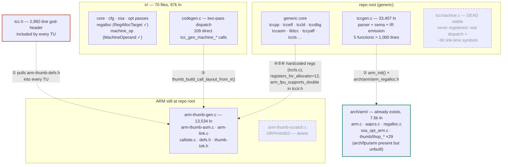
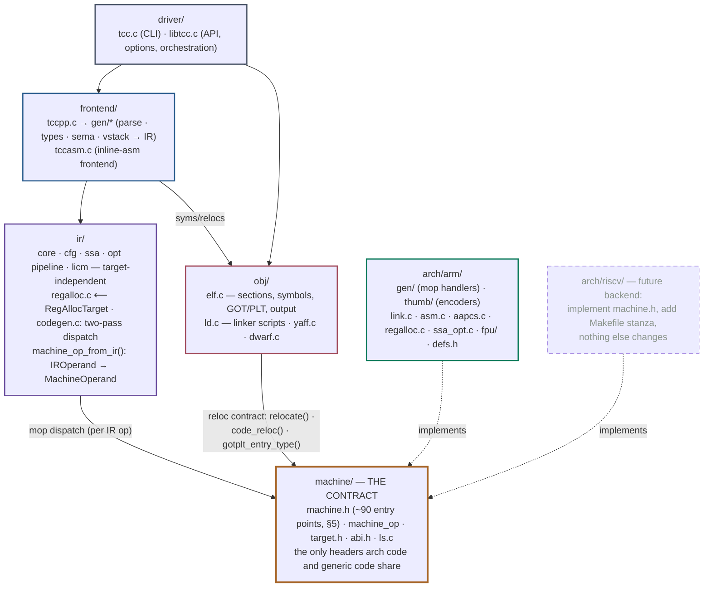

# Restructuring the source tree for multi-architecture support

> tinycc · armv8-m fork · architecture proposal · 2026-07-03
>
> Styled version with full diagrams: [restructure_architecture.html](restructure_architecture.html)
> (self-contained, open in a browser). This Markdown is the diff-friendly source of truth;
> Mermaid diagrams render on GitHub and in VS Code preview.

A `source/` root with generic compiler layers, one machine contract, and self-contained
backends under `source/arch/` — plus a test tree that mirrors it. Designed so the next
architecture is a directory, not a rewrite.

| | |
|---|---|
| Top-level C | 91k lines |
| `ir/` | 97k lines |
| `tccgen.c` | 33,407 lines |
| `arm-thumb-gen.c` | 13,534 lines |
| `tcc.h` | 2,892 lines, included everywhere |
| Backend seam | already ~80% in place |

## Contents

1. [Goals & ground rules](#1-goals--ground-rules)
2. [Where the code is today](#2-where-the-code-is-today)
3. [Target source tree](#3-target-source-tree)
4. [Layered architecture](#4-layered-architecture)
5. [The backend contract](#5-the-backend-contract--machinemachineh)
6. [Splitting tccgen.c](#6-splitting-tccgenc--33407-lines--10-files)
7. [Splitting arm-thumb-gen.c](#7-splitting-arm-thumb-genc--13534-lines--13-files)
8. [Header topology](#8-header-topology--dismantling-tcch)
9. [Target test tree](#9-target-test-tree--mirroring-source)
10. [Migration plan](#10-migration-plan--seven-phases-each-shippable)
11. [Adding an architecture](#11-adding-an-architecture--the-checklist)
12. [Risks & decisions](#12-risks--open-decisions)

---

## §1 Goals & ground rules

- **Physical layout matches logical layers.** Everything moves under `source/`;
  architecture-specific code lives only in `source/arch/<name>/`; generic code never
  includes an arch header.
- **Huge files become functional blocks.** `tccgen.c` (33k) splits into ~10 files,
  `arm-thumb-gen.c` (13.5k) into ~13, along the block boundaries mapped in §6–§7.
- **A second architecture drops in.** One written contract (§5) is the complete list of
  what a backend implements. Register facts, ABI classification, and relocations all flow
  through it.
- **Every phase keeps `make test` green.** The plan (§10) is a sequence of mechanical,
  individually verifiable steps — no big-bang branch.
- **History survives.** Moves are pure `git mv` commits, separate from content edits, so
  `git blame -C` stays useful.

> **Good news first.** This is not a greenfield redesign. The amalgamation build is
> already gone (every `.c` compiles separately; only `tcc.c` includes `tcctools.c`).
> `arch/arm/` already exists with clean pieces — AAPCS classification, a `RegAllocTarget`
> descriptor, 29 Thumb-2 encoder modules — and the build system already documents how to
> add an architecture. The IR operand seam (`MachineOperand`, `machine_op_from_ir`) is
> fully target-neutral. What remains is finishing a boundary that is ~80% built.

## §2 Where the code is today

The load-bearing backend interface today is a flat set of **~90 `tcc_gen_machine_*` /
`tcc_machine_*` symbols** declared in `tcc.h:2576–2726` and resolved at link time. A
second, aspirational vtable (`TCCMachineInterface` in `tccmachine.h/.c`) exists but is
dead: `tcc_machine_register()` is never called. Meanwhile the largest ARM files still sit
at the repo root, outside `arch/`.



*Fig. 1 — Today's top level. Dashed arrows ①–⑥ are the hard couplings that break the
generic/arch boundary; dead boxes are code to delete.*

### The six hard leaks (generic → ARM)

| # | Where | Leak | Fix |
|---|-------|------|-----|
| ① | `tcc.h:358` | Unconditionally includes `arm-thumb-defs.h` — every generic TU compiles against `NB_REGS`, `TREG_*`, `RC_*`, ARM reloc aliases | Backend defs come in via the machine contract header only |
| ② | `tccgen.c:38, 1028, 30983` | Includes `arch/arm/arm_regalloc.h`; calls `arm_init()` and `arm_get_regalloc_target()` directly | Generic `tcc_backend_init()` + `tcc_backend_regalloc_target()` hooks |
| ③ | `ir/codegen.c:1915` | Generic dispatcher calls `thumb_build_call_layout_from_ir()` by name | Add call-layout entry point to the contract |
| ④ | `tccls.c:125–320` | Hardcodes SP=R13 mask, R12 special case, "scratch from R0–R3", 16-register bounds in nominally generic linear-scan code | Read all register facts from `RegAllocTarget` |
| ⑤ | `tccgen.c:30891` | `registers_for_allocator = 12` hardcoded (backend sets 13 elsewhere — duplicated magic) | Single source of truth in `RegAllocTarget` |
| ⑥ | `tccir.h:718` | Generic IR header declares `arm_fpu_supports_double()` | Replace with `tcc_target_has()` capability query (already exists in `tcc_target.h`) |

Beyond these, `#ifdef TCC_TARGET_ARM_THUMB` appears at only ~17 sites in generic code —
mostly benign option-parsing and section-name islands in `libtcc.c`, `tccelf.c`,
`tccdbg.c` that can migrate to contract hooks gradually. The relocation engine is already
split correctly: `tccelf.c` drives, `arm-link.c` implements
`relocate`/`code_reloc`/`gotplt_entry_type`.

## §3 Target source tree

File basenames keep their identity where the file moves unchanged (`←` annotations show
origin); new names appear only where a file is split. Repo root keeps `include/` (headers
shipped to compiled programs), `lib/` (runtime library), `tests/`, `scripts/`, `docs/`.

```text
source/
├── driver/                        # entry points & public API
│   ├── tcc.c                      # CLI main + tool dispatch
│   ├── tcctools.c                 # ar / cross-prefix tools
│   └── libtcc.c                   # TCCState lifecycle, options, compile/link driver
├── frontend/                      # C language → IR
│   ├── tccpp.c                    # preprocessor + tokenizer
│   ├── tccasm.c                   # GAS-style asm frontend (arch-neutral core)
│   ├── tcctok.h · tccdefs.h
│   └── gen/                       # tccgen.c split — see §6
│       ├── gen_priv.h             # shared vstack/scope/switch state (the linchpin)
│       ├── gen_core.c  gen_sym.c  gen_vstack.c  gen_ops.c  gen_types.c
│       ├── gen_expr.c  gen_builtins.c  gen_stmt.c  gen_init.c
│       └── gen_decl.c             # decl, nested fns, gen_function IR-pipeline driver
├── ir/                            # target-independent IR — moves largely as-is
│   ├── core.c  cfg.c  ssa.c  dump.c  vreg.c  stack.c  live.c  licm.c
│   ├── operand.c                  # ← tccir_operand.c (SValue ↔ IROperand)
│   ├── passes.c                   # ← tccopt.c (pass registry)
│   ├── opt/                       # all opt_*.c + ssa_opt_*.c consolidated
│   ├── regalloc.c                 # SSA regalloc — parameterized by RegAllocTarget ✓
│   └── codegen.c                  # two-pass dry-run/real-run dispatch loop
├── machine/                       # THE seam — generic side of the backend boundary
│   ├── machine.h                  # the written contract: every symbol a backend implements (§5)
│   ├── machine_op.c/.h            # ← ir/machine_op.* (MachineOperand — already clean)
│   ├── target.h                   # ← tcc_target.h (ArchitectureConfig, capabilities)
│   ├── abi.h                      # ← tccabi.h (TCCAbiArgDesc / CallLayout)
│   └── ls.c                       # ← tccls.c, de-ARM'd (leak ④)
├── obj/                           # object containers, linking, debug info
│   ├── elf.c                      # ← tccelf.c (ARM islands → reloc hooks)
│   ├── ld.c                       # ← tccld.c (linker scripts — already 100% generic)
│   ├── yaff.c                     # ← tccyaff.c (R_ARM_* enums → contract reloc kinds)
│   ├── dwarf.c                    # ← tccdbg.c (DWARF/stabs)
│   └── elf.h · dwarf.h · stab.h
├── support/
│   ├── log.h  tcc-chained-hash.h
│   └── tccdebug.c                 # SValue/Sym pretty-printers
└── arch/
    ├── arm/
    │   ├── arm.c  arm.h           # target init: ArchitectureConfig, capabilities
    │   ├── defs.h                 # ← arm-thumb-defs.h (NB_REGS, TREG_*, RC_*)
    │   ├── aapcs.c                # ← arm_aapcs.c (ABI classification)
    │   ├── regalloc.c             # ← arm_regalloc.c (RegAllocTarget tables)
    │   ├── ssa_opt.c              # ← ssa_opt_arm.c (MLA fusion, shl+add→indexed, …)
    │   ├── gen/                   # arm-thumb-gen.c split — see §7
    │   ├── thumb/                 # thop_*.c encoders ×29 — unchanged
    │   ├── asm.c                  # ← arm-thumb-asm.c (mnemonic parser → thop_*)
    │   ├── tok.h                  # ← thumb-tok.h
    │   ├── link.c                 # ← arm-link.c (R_ARM_* relocations)
    │   └── fpu/                   # ← arch/fpu/arm — finally wired into arm_resolve_fpu()
    └── riscv/                     # future — implements machine/machine.h, nothing else
```

> **Deletions, not moves.** `arm-thumb-scratch.c` is orphaned (built by nothing, included
> by nothing — the live scratch logic is inside `arm-thumb-gen.c`): delete it. The dead
> `TCCMachineInterface` vtable in `tccmachine.h/.c` is superseded by the contract header
> (§5 decision): delete it too. Legacy upstream test drivers (`tcctest.c`, `abitest.c`,
> `tests/Makefile` suite) quarantine under `tests/legacy/`.

## §4 Layered architecture



*Fig. 2 — Target layers. Solid arrows are calls; dashed arrows are backends implementing
the machine contract. `machine/` is the only crossing point between generic and
architecture-specific code.*

### Dependency rules (CI-enforceable)

- `driver/ → frontend/, ir/, obj/, machine/` — orchestration only.
- `frontend/ → ir/, machine/` (emission primitives, ABI queries); `frontend/ → obj/` only
  for symbol/section glue (`put_extern_sym`, relocations on initializers).
- `ir/ → machine/` — the dispatch loop and regalloc consume only contract types.
- `obj/ → machine/` — reloc/attribute hooks; never `R_ARM_*` by name.
- `arch/<t>/ → machine/, ir/ headers, support/` — a backend may see generic types, never
  frontend internals.
- **Nothing outside `arch/` includes anything inside `arch/`.** One grep in CI keeps this
  true forever:

  ```sh
  grep -rn '#include "arch/' source/ --exclude-dir=arch   # must return empty
  ```

## §5 The backend contract — `machine/machine.h`

The interface already exists in practice — it is just scattered and unwritten. The
contract header collects the ~90 entry points, grouped and documented, so "port tinycc"
becomes "implement this file". Group sizes below are from the live `tcc.h:2576–2726`
surface plus the reloc backend.

| Group | ≈ | Entry points (representative) | Notes |
|-------|---|-------------------------------|-------|
| materialization | 10 | `acquire/release_scratch` · `load/store_spill_slot` · `load_constant` · `addr_of_stack_slot` · `can_encode_stack_offset` | Integer-arg primitives used by ir/mat + regalloc |
| mop handlers | ~45 | `data_processing_mop` · `load/store[_indexed\|_postinc]_mop` · `muldiv_mop` · `mla/umull/smull_mop` · `fp_mop` · `func_call_mop` · `select_mop` · `block_copy_mop` · `vla_mop` · `setjmp/trap/prefetch`… | One per IR op family; all take `MachineOperand` |
| frame | 8 | `prolog` · `epilog` · `finish_noreturn` · `store_to_stack/sp` · `number_of_registers` · `gfunc_sret` · nested-fn trampoline | Frame layout + return-value classification |
| branches | 8 | `jump_mop` · `conditional_jump_mop` · `cbz_jump_mop` · `backpatch_jump` · `switch_table/load_mop` · `*_dry_run_size` | Relaxation policy stays in the backend |
| two-pass hooks | ~15 | `dry_run_init/start/end` · `insn_scratch_reset/count/saves_mask` · `branch_opt_init/analyze` · `*_cache_reset` · `pending_pool_size` · `reserve_pool_bytes` · `end_instruction` | Driven by ir/codegen.c's dry-run/real-run loop |
| ABI | 5 | `abi_classify_argument` · `abi_assign_call_args` · `build_call_layout` (fixes leak ③) · `abi_softcall_name` | Types in `machine/abi.h` |
| target | 5 | `backend_init/deinit` (fixes leak ②) · `regalloc_target()` · `target_has(cap)` · `resolve_fpu()` | Fills `ArchitectureConfig` + `RegAllocTarget` |
| relocations | 4 | `relocate` · `relocate_plt` · `code_reloc` · `gotplt_entry_type` | Already the upstream xxx-link.c shape; `obj/elf.c` is the driver |
| asm (optional) | 2 | asm opcode parser hook · asm token table | Backends without inline-asm support stub these |

> **Decision: link-time binding, not a vtable** *(recommended — matches how the fork
> already works).* Each target is a separate cross-compiler binary (`armv8m-tcc`), exactly
> one backend linked in — so link-time symbol resolution is a zero-cost dispatch that the
> hot two-pass codegen loop already relies on (109 call sites in `ir/codegen.c`).
> Formalize the symbol set in `machine/machine.h` and **delete the dead
> `TCCMachineInterface` vtable** rather than reviving it. If a multi-target single binary
> is ever wanted, the contract header is precisely the struct definition a vtable would
> need — nothing is lost by waiting.

> **Generic logic to hoist out of the backend — later, §10 phase 6.** Five pieces of
> genuinely generic machinery currently live inside `arm-thumb-gen.c` and would otherwise
> be rewritten by every new backend: the dry-run scratch-discovery state machine,
> 64-bit-as-register-pair lowering, the parallel-move solver for call arguments,
> mul-by-constant strength reduction, and the peephole cache frameworks (MOV-equivalence,
> immediate reuse, STR→LDR forwarding). Hoist them into `machine/` as shared engines
> parameterized by backend callbacks — but only when the second architecture arrives and
> proves the parameterization, not speculatively.

## §6 Splitting tccgen.c — 33,407 lines → 10 files

Location: `frontend/gen/` · shared state declared once in `gen_priv.h`.

The file's ~35 internal blocks condense into ten modules. The entangling state is
well-understood: `vtop`/`_vstack` (2,160 refs), `tok` (322), `loc`, `nocode_wanted`,
scope/switch stacks. `gen_priv.h` declares all of it (definitions live in `gen_core.c`),
plus the current forward-decl list — the file's own lines 746–789 are the seed set.

| File | ≈ lines | Contents (today's blocks) | Coupling |
|------|--------:|---------------------------|----------|
| `gen_core.c` | 1,200 | Global state definitions, lifecycle (`tccgen_init/compile/finish`), type predicates, code-suppression (`nocode_wanted`) | owns state |
| `gen_sym.c` | 1,100 | Symbol table, labels, ELF symbol glue (`put_extern_sym`, `greloc`), attribute merge/patch, aliases | clean — move first |
| `gen_vstack.c` | 1,700 | Value-stack ops, `gv/gv2`, long-long expand, addressing, bitfields, bounds | vstack core |
| `gen_ops.c` | 2,300 | `gen_opl/opic/opif`, `gen_op`, complex arithmetic, vector extensions | heavy vtop |
| `gen_types.c` | 2,900 | Type compare/compat, casts, `type_size`, struct layout + declaration, `parse_btype`, declarators | AAPCS alignment here |
| `gen_expr.c` | 6,500 | Unary/primary/postfix, `unary_funcall`, binary precedence, ternary, `gexpr`, const-expr | vtop + tok |
| `gen_builtins.c` | 3,800 | `unary_builtin_*`, string-builtin folding, auto-inline heuristics, `try_inline_const_eval` | clean — move early |
| `gen_stmt.c` | 1,900 | `block/block_1`, switch codegen, return, scopes/cleanups, VLA scope handling | tok + vtop |
| `gen_init.c` | 3,200 | `vstore`, `inc`, initializers, designators, `decl_initializer_alloc` | vtop |
| `gen_decl.c` | 5,300 | `decl`, nested functions/trampolines, `gen_function` (the IR-pipeline driver: SSA, opt passes, regalloc, codegen), inline stash, late reopt | IR-facing — owns ir/ includes |

- **Extraction order:** `gen_sym` → `gen_builtins` → `gen_decl` (only 7 vtop refs in the
  `gen_function` region) → `gen_types` → `gen_stmt` → `gen_init` → `gen_ops` →
  `gen_expr` → what remains is `gen_core` + `gen_vstack`.
- **Watch one handshake:** the AAPCS invisible-copy state (`aapcs_last_const_init`, set
  during parameter typing, consumed in `unary_funcall`) crosses the types/expr boundary —
  promote it to an explicit field in `gen_priv.h`, not a bare static.
- After the split, `gen_decl.c` is the only frontend file that sees the IR optimization
  pipeline; the rest use emission primitives from `tccir.h` only.

## §7 Splitting arm-thumb-gen.c — 13,534 lines → 13 files

Location: `arch/arm/gen/` · split by mop family, matching the contract groups.

| File | ≈ lines | Contents (today's line ranges) |
|------|--------:|-------------------------------|
| `state.c` | 600 | ThumbGeneratorState, reg classes, frame-offset helpers, MachineCodegenContext allocators *(54–740)* |
| `scratch.c` | 900 | Scratch acquire/release/spill, push-window bias, dry-run scratch discovery hooks *(1419–1794 + snapshot state)* |
| `caches.c` | 700 | mov_equiv, imm_cache, strldr_cache, spill cache — peephole trackers *(1812–2287)* |
| `litpool.c` | 700 | Literal pools: init/reserve/flush/find, IT-window guard *(2345–2782, 4112–4200)* |
| `emit.c` | 900 | `o()/ot()`, opcode validation, branch patching/relaxation (`decbranch`, `th_patch_call`), dry-run/branch-opt state machine *(853–1272, 2509–3402)* |
| `alu.c` | 1,000 | Data-processing mops 32/64-bit, shifts, ubfx/bfi *(4993–5950)* |
| `muldiv.c` | 1,050 | mul/div/MLA/UMULL/SMULL/MLAL, mul-by-const strength reduction, pack64, cmp_eq64 *(5952–6921)* |
| `mem.c` | 1,500 | load/store/indexed/postinc mops, spill slots, strd/ldrd pairing, assign, setif/bool *(3647–4530, 6987–8463)* |
| `fp.c` | 1,000 | VFP + soft-float dispatch (`get_softfp_func_name`), complex lowering *(8463–9476)* |
| `frame.c` | 900 | prolog/epilog, noreturn finish, VLA alloc, `gfunc_sret`, LEA, stack stores *(3564–3646, 9476–10347)* |
| `call.c` | 2,100 | Call generation, AAPCS arg placement, ThumbArgMove parallel-move solver; absorb `arm-thumb-callsite.c` *(10348–12120)* |
| `branch.c` | 500 | jump/conditional/cbz mops, chain slots, switch tables, indirect jump *(3413–3555, 12120–12280)* |
| `intrin.c` | 700 | select/block-copy mops, trap/prefetch/setjmp/longjmp, builtin_apply, trampolines *(12281–13534)* |

The cut lines are unusually clean because handlers already communicate through
`MachineOperand` and the shared generator state — the split is mostly moving functions
plus one `gen_priv.h`-style internal header (`arch/arm/gen/gen.h`) for the state struct
and cross-file statics.

## §8 Header topology — dismantling tcc.h

The 2,892-line god-header already contains its own split map: lines 1870–2532 are
per-module prototype banners (`/* ---- tccpp.c ---- */` …) — each becomes that module's
own header. What remains is a small set of genuinely shared headers:

| New header | From tcc.h | Contents |
|------------|-----------:|----------|
| `source/config.h` | :26–243 | Platform shims, target-select ladder, threading |
| `source/core_types.h` | :384–914 | The shared data model: `CType`, `CValue`, `SValue`, `Sym`, `Section`, TokenString — needed by every layer |
| `source/state.h` | :915–1524 | `TCCState` + extended symbol attributes |
| `frontend/tokens.h` | :1636–1869 | Token constants (wraps `tcctok.h`) |
| per-module headers | :1870–2532 | `pp.h`, `gen.h`, `elf.h`, `asm.h`, `dwarf.h`, `yaff.h`… — each owns its banner |
| `machine/machine.h` | :2576–2726 | The backend contract (§5); replaces the xxx-gen.c banner |
| `arch/arm/defs.h` | :358 include | `NB_REGS`, `TREG_*`, `RC_*`, `PTR_SIZE`, float-ABI enums — **no longer included by generic code**; generic layers read register facts from `RegAllocTarget`/`ArchitectureConfig` at runtime |

A transitional `tcc.h` that includes the new pieces keeps every TU compiling during the
split; it shrinks to a compatibility shim and is deleted at the end. The one behavioral
constant to preserve: `PTR_SIZE` and `LDOUBLE_SIZE` are compile-time constants per target
binary — they stay macros, provided by the per-arch defs through the build system's
`-DTCC_TARGET_*` defines, not through a generic include of an arch header.

## §9 Target test tree — mirroring source/

generic = host-runnable with plain gcc · arch = needs the cross toolchain/QEMU.

```text
tests/
├── generic/                       # zero QEMU/newlib dependency — runs anywhere
│   ├── frontend/                  # ← tests/frontend (diagnostics · pp · types)
│   ├── ir/                        # unit tests for ir/ passes (from tests/unit split)
│   ├── golden_ir/                 # ← tests/ir_tests/golden — pass-level IR snapshots
│   ├── linker/                    # ← tests/linker (readelf/objdump goldens)
│   └── debug/                     # ← tests/debug (DWARF/STAB goldens)
├── arch/
│   └── arm/
│       ├── unit/                  # thop_*, aapcs, arm_link, backend gen_* byte-exact tests
│       ├── asm/                   # ← tests/thumb/armv8m (encode vs arm-none-eabi-gcc)
│       ├── qemu/                  # ← tests/ir_tests execution suite + mps2-an505 board + newlib
│       ├── runtime/               # ← tests/runtime/cross (aeabi, soft-fp)
│       ├── gcc_torture/           # ← ir_tests/test_gcc_torture_ir.py
│       └── selfhost/              # compiles the compiler with armv8m-tcc
├── fuzz/                          # differential fuzzer — stays, opt-in as today
├── host/                          # native aeabi/soft-fp checks (test-aeabi-host)
├── support/ut.h                   # shared unit harness + coverage scripts
├── externals/ · benchmarks/       # opt-in corpora, unchanged
└── legacy/                        # quarantined upstream suite (tcctest.c, abitest…)
```

- **The one real complication:** today's single `tests/unit/arm/armv8m` build links
  generic IR-pass tests and ARM encoder tests into one binary. Split it along the
  existing `UT_MODULE_SRCS` boundary: `tests/generic/ir/` links only `source/ir/` (+
  operand/svalue) with stubs; `tests/arch/arm/unit/` links `arch/arm/**` + the backend.
  `source_coverage_map.json` already keys every test by source path — it is the
  machine-readable migration map.
- **Axis chosen deliberately:** the tree mirrors *source layout* (the stated goal). Note
  the imperfect overlap with runnability — linker/debug goldens contain ARM ELF yet run
  host-side; they stay in `generic/` because they test generic drivers (`obj/elf.c`,
  `obj/dwarf.c`) whose goldens are per-target files.
- **Wiring to update in lockstep** (all grep-able single points): top-level Makefile
  suite dirs + `NEWLIB_*` paths, `tests/run_tests.py`, per-suite `conftest.py`,
  `gen_source_coverage.py`, `.gitignore`, and the fuzz infra's cached paths
  (`.sweep_cache` keys miss header moves — clear it).
- **Keep the gates:** `make check-pass-coverage` (pass ↔ test ledger) and the selfhost
  suite (sole coverage for `arch/arm/arm.c`/`aapcs.c`) survive the move unchanged.

## §10 Migration plan — seven phases, each shippable

Every phase ends with `make test` green on a clean branch off `mob`.

| Phase | Title | Work | Gate |
|-------|-------|------|------|
| **0** moves | Pure git-mv restructure + dead-code deletion | Create `source/`; move files with names unchanged; move the six root-level ARM files into `arch/arm/`; delete `arm-thumb-scratch.c`; quarantine `tests/legacy/`. Update Makefile path lists (`CORE_FILES`, `armv8m_FILES`, `-I` paths, the `LIBTCC_INC` rebuild wart) and include paths — zero code changes otherwise | `make test` green · `git blame -C` intact · one commit = moves only |
| **1** headers | Split tcc.h; stop leaking arm-thumb-defs.h | Extract `config.h`, `core_types.h`, `state.h`, per-module headers from the prototype banners (§8). Generic TUs stop including `arch/arm/defs.h`; register facts flow through `RegAllocTarget`/`ArchitectureConfig` | CI grep: no `#include "arch/` outside `source/arch/` |
| **2** seam | Seal the contract | Write `machine/machine.h` (§5); fix leaks ②③④⑤⑥; delete the dead vtable; wire `arch/fpu/arm` into `arm_resolve_fpu()`; de-ARM `machine/ls.c`; single-source `registers_for_allocator` | `make test` green · unit suites for regalloc/ls pass unmodified |
| **3** tccgen | Split tccgen.c → frontend/gen/ (10 files) | Create `gen_priv.h`; extract in dependency order (`sym → builtins → decl → types → stmt → init → ops → expr`), one file per commit, running the frontend + IR suites each step | `make test` after every extraction · no new ST_DATA globals |
| **4** arm gen | Split arm-thumb-gen.c → arch/arm/gen/ (13 files) | Same discipline; the byte-exact backend unit tests (`test_gen_*`) pin emitted Thumb-2 encodings across the split | test-asm + backend unit suite byte-identical output |
| **5** tests | Restructure tests/ to mirror source/ | Move suites per §9; split the unit binary generic-vs-arch; update Makefile, run_tests.py, coverage generator; regenerate `source_coverage_map.json` | `make test` green · `check-pass-coverage --strict` passes · fuzz smoke (batch_sweep) clean |
| **6** hoist | Hoist generic engines out of the backend (deferred) | Parallel-move solver, 64-bit pair lowering, dry-run scratch protocol, peephole cache frameworks → `machine/`. Do this when the second backend starts, so real requirements drive the parameterization | triggered by arch #2 — not before |

> **Sequencing constraints.** Start from a clean tree — the current branch
> (`heapOverflowBug`) carries a large in-flight diff; land or stash it first. Never run
> fuzz sweeps or bisects while the tree is mid-restructure (the sweep cache keys miss
> header moves, and reducers/sweeps racing a rebuild report phantom divergences). Phases
> 3 and 4 are independent and can interleave with normal bug-fix work — each extraction
> commit is small and revertible.

## §11 Adding an architecture — the checklist

What `arch/<name>/` must provide once the restructure lands:

1. **`defs.h`** — register names/counts, `PTR_SIZE`, float-ABI constants (seen only by
   this backend and the build defines).
2. **`<name>.c`** — `backend_init()`: fill `ArchitectureConfig` (capabilities, FP feature
   bits via `fpu/` tables).
3. **`regalloc.c`** — a `RegAllocTarget`: int/FP register classes, caller/callee-saved
   sets, param regs, static-chain reg.
4. **`abi.c`** — `abi_classify_argument()` + call-layout builder for the target's calling
   convention.
5. **`gen/`** — the ~90 contract entry points (§5). Start with the ~25 that the two-pass
   loop requires to emit straight-line code (mop handlers for ALU/load/store/call/branch
   + frame + materialization); the rest — peephole hooks, dry-run size estimators — have
   safe conservative defaults.
6. **`link.c`** — `relocate`, `code_reloc`, `gotplt_entry_type` for the target's reloc
   types.
7. **Optional:** `asm.c` + token table (inline assembly), `ssa_opt.c` (target peephole
   generators registered into the SSA pipeline), `fpu/` feature tables.
8. **Build:** one Makefile stanza (`<target>_FILES`, `DEF-<target>`, `<target>_ARCH`) —
   the `arch/Makefile` dispatcher already documents this.
9. **Tests:** `tests/arch/<name>/` — unit encoders first, then an execution board under
   `qemu/` mirroring `mps2-an505`.

## §12 Risks & open decisions

| Risk / decision | Position |
|-----------------|----------|
| **Golden churn.** IR goldens, byte-exact backend tests, and objdump goldens are path- and layout-sensitive | Phases 0–2 change no codegen output by construction; goldens act as the regression oracle, never regenerate during a move phase |
| **Fuzz infrastructure paths.** Sweep caches, triage scripts, bisect_opt.py reference file paths | Clear `.sweep_cache` after each phase; run a 500-seed batch_sweep smoke across profiles as the phase-5 gate |
| **Where does tccasm.c sit?** The GAS frontend is generic but exists to feed arch mnemonic parsers | Frontend, with the mnemonic parser behind the contract's optional asm hooks (matches today's tccasm.c → arm-thumb-asm.c split) |
| **YAFF reloc coupling.** `obj/yaff.c` hardcodes `R_ARM_*` enums | Phase 2 introduces contract reloc-kind mapping; until then YAFF is de-facto ARM-only (as today) |
| **Dispatch mechanism.** Vtable vs link-time symbols | Link-time (§5) — one backend per binary, zero-cost, delete the dead vtable |
| **Naming.** Keep `tcc*` basenames or re-name on move? | Phase 0 keeps basenames (pure moves); renames happen only where files split anyway (§6–§7). Directory names carry the taxonomy |
| **PTR_SIZE as a macro.** Generic code has 43 `#if PTR_SIZE` sites | Acceptable: it's a per-binary constant delivered by build defines. Do not convert to runtime queries — codegen constant-folds on it |

---

*Figures & counts from a source survey of the working tree (branch `heapOverflowBug`),
2026-07-03. Styled HTML version: [restructure_architecture.html](restructure_architecture.html).*
