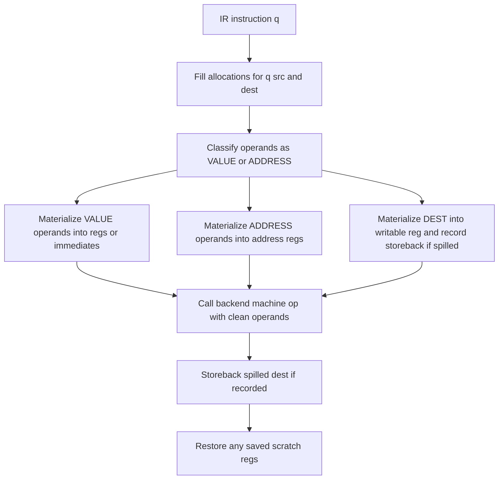

# Load/Spill Refactor Plan

## Goal
Make load/spill handling *simple and explicit*:

- Backend machine generators must **always** receive VALUE operands as **registers or immediates**.
- Spill loading/storeback must be done in the IR layer (in [`tcc_ir_generate_code()`](tccir.c:4252)).

This removes the current “semantic guessing” split between IR rewriting and backend heuristics.

## Current problem summary
Today, operand semantics are inferred via a mix of:

- IR-side rewriting in [`tcc_ir_fill_registers()`](tccir.c:1795) (mutating `SValue` fields like `r`, `pr0/pr1`, `c.i`, and relying on `interval->is_lvalue`).
- Backend-side special cases (ARM Thumb) in:
  - [`tcc_ir_preload_spills()`](arm-thumb-gen.c:420) and [`tcc_ir_storeback_spill()`](arm-thumb-gen.c:1114)
  - [`load_to_dest()`](arm-thumb-gen.c:2959) and helpers, which interpret combinations of `VT_LOCAL`, `VT_LVAL`, `PREG_SPILLED`, and vreg type.

This creates hard-to-reason ambiguities, especially for:

- “spilled temp holding a pointer” vs “concrete local storage slot”
- `VT_LOCAL` without `VT_LVAL` (address-of) vs “spilled value in stack slot”
- two-level indirection cases (spilled lvalues)

## Target end-state contract (IR → backend)

### Contract
For every backend machine op invoked from [`tcc_ir_generate_code()`](tccir.c:4252):

1) **VALUE operands** passed to the backend are either:
   - immediate (`VT_CONST` without `VT_SYM`), or
   - physical register number in `pr0/pr1` (never `PREG_NONE`, never `PREG_SPILLED`).

2) **ADDRESS operands** are passed in a single, explicit representation:
   - preferred: a register holding the address
   - optional: backend-specific base+offset if kept, but must be explicit and not overloaded with spill meaning

3) Backends do **not** implement spill policies and do **not** interpret spill slots.

### Consequence
Backend `load`/`store` helpers can be simplified to “true” load/store only (reg/imm/address), without spill-slot heuristics.

## Design: IR-side operand materialization

Add IR-owned materialization helpers inside [`tcc_ir_generate_code()`](tccir.c:4252), after register allocation is filled (via [`tcc_ir_fill_registers()`](tccir.c:1795)) and before calling any backend op.

### Materialization helpers (conceptual)

1) `materialize_value(src)`
   - Output: `src` rewritten to be either immediate or physical register.
   - If `src` is spilled/stack-backed → emit a load from spill slot into a scratch reg.
   - If `src` is an lvalue-in-memory → first materialize address, then load the value.

2) `materialize_addr(src)`
   - Output: physical register holding the address.
   - If `src` is stack-slot address-of (e.g. `VT_LOCAL` without `VT_LVAL`) → emit address calculation.
   - If address is already in a reg → keep it.

3) `materialize_dest(dest)`
   - Output: writable register(s) for the result.
   - If `dest` is spilled → allocate scratch dest reg(s), rewrite `dest` to those reg(s), and record storeback.

### Operation-driven classification
Materialization decisions should be driven by IR op semantics, not flag guessing:

- `TCCIR_OP_LOAD`: `src1` is ADDRESS, `dest` is VALUE
- `TCCIR_OP_STORE`: `dest` is ADDRESS, `src1` is VALUE
- arithmetic ops: sources are VALUE, dest is VALUE
- compare/test: sources are VALUE
- call/return: sources are VALUE (except function pointer target, which is an ADDRESS-like value)

This reduces reliance on heuristics like [`tcc_ir_operand_needs_dereference()`](tccir.c:5397) and moves the remaining deref decisions to explicit op semantics.

## Minimal target-independent machine API (project-wide)
To implement the above without backend-specific spill logic, introduce a minimal “machine support” API used by IR:

- Scratch reg allocation with optional save/restore (so IR materialization is safe under pressure)
- Load from spill slot (frame-relative)
- Store to spill slot (frame-relative)
- Compute address of a stack slot (frame-relative)

Where it likely lives:

- Declarations in [`tcc.h`](tcc.h) (or a small new header)
- Implementations per backend (e.g. ARM uses existing logic from [`get_scratch_reg_with_save()`](arm-thumb-gen.c:275), and stack access helpers like [`tcc_gen_machine_store_to_stack()`](arm-thumb-gen.c:6559)).

## Stack abstraction plan
Make stack allocations predictable by representing them explicitly instead of passing raw offsets around:

- **Slot descriptors:** introduce a `TCCStackSlot` record in [tccir.c](tccir.c) that captures the slot kind (local, spill, VLA, parameter spill), byte size, alignment, owning IR vreg, and whether the slot survives calls. This gives every stack location a stable identity beyond “offset -24”.
- **Layout builder:** generate a per-function `TCCStackLayout` after register allocation that orders the descriptors, computes offsets relative to frame pointer or stack pointer, and tracks dynamic areas (VLA growth, saved registers). Materialization code can then ask the layout for “address of slot X” without re-deriving offsets.
- **API + docs:** expose helpers such as `tcc_ir_stack_slot_offset()` and use them inside the upcoming `materialize_addr()` plus [`tcc_machine_addr_of_stack_slot()`](arm-thumb-gen.c#L2722-L2757). Document the abstraction next to [docs/IR_MACHINE_CONTRACT.md](../docs/IR_MACHINE_CONTRACT.md) so backend authors know which slots exist.
- **Testing hooks:** add debug dumps (behind a flag) that print the computed layout for each function, making it easy to spot overlapping slots or misaligned VLAs when expanding the abstraction to other architectures.

## Backend simplification (ARM as example)
Once IR owns spill materialization:

- Remove/retire backend-level spill preloading/storeback:
  - [`tcc_ir_preload_spills()`](arm-thumb-gen.c:420)
  - [`tcc_ir_storeback_spill()`](arm-thumb-gen.c:1114)

- Simplify backend load/store core helpers:
  - [`load_to_dest()`](arm-thumb-gen.c:2959) and [`store()`](arm-thumb-gen.c:2141)
  - Stop checking `PREG_SPILLED` and stop inferring semantics from `VT_LOCAL`/`VT_LVAL` beyond “is this an lvalue?”

## Control-flow sketch

## Risks / must-cover edge cases
These are the cases that must drive testing because they are the source of current complexity:

- Spilled temp holding pointer vs concrete local storage slot
- `VT_LOCAL` address-of vs “spill slot containing a value”
- 64-bit values (register pairs + spill slots) and correct storeback order
- VLA/dynamic SP changes (avoid push/pop scratch saving when SP becomes unstable; see [`TCCIR_OP_VLA_ALLOC` handling](tccir.c:4446))

## Spill ambiguity audit (2026-01-08)

- [tccir.c](tccir.c#L1795-L1877) — `tcc_ir_fill_registers()` rewrites every spilled interval to look like a stack slot by forcing `sv->r = VT_LOCAL | need_lval`. The `need_lval` bit is inferred from the previous `sv->r` flags and `interval->is_lvalue`, so the backend must guess whether plain `VT_LOCAL` means “address-of stack slot” or “value spilled to stack”, especially when `interval->allocation.offset != 0` but `interval->is_lvalue == 0` (destinations of LOAD/ASSIGN).
- [arm-thumb-gen.c](arm-thumb-gen.c#L420-L934) — `tcc_ir_preload_spills()` re-derives operand semantics by combining `VT_LOCAL`, `VT_LVAL`, the IR op, and vreg types. For example, the LOAD path distinguishes spilled temporaries vs actual locals by checking `TCCIR_VREG_TYPE_TEMP` before deciding whether to load a pointer value or compute the slot address, while global symbol operands strip/reapply `VT_LVAL` depending on whether the op is `LOAD`, `ASSIGN`, or something else.
- [arm-thumb-gen.c](arm-thumb-gen.c#L1114-L1203) — `tcc_ir_storeback_spill()` restores the original spill view (resetting `q->dest.pr0`, `q->dest.r = VT_LOCAL`) before delegating to `store()`, so every backend store has to re-detect spills instead of receiving an explicit “write this register back to offset”.
- [arm-thumb-gen.c](arm-thumb-gen.c#L2140-L2350) — `store()` contains multiple heuristics to decide whether a `VT_LOCAL` destination is a true stack slot or an address read from a spilled pointer (`PREG_SPILLED` plus `TCCIR_VREG_TYPE_TEMP`). Misclassification leads to double-indirection bugs (loading the slot contents as a pointer or vice versa).
- [arm-thumb-gen.c](arm-thumb-gen.c#L2963-L3180) — `load_to_dest()` mirrors the same logic for loads: `VT_LOCAL | VT_LVAL` might mean preloaded address vs genuine stack storage; `VT_LOCAL` without `VT_LVAL` might be either address-of or spilled value depending on whether `pr0` has `PREG_SPILLED` and which vreg type produced it. This is why `load_to_dest()` has branches for `sv->vr == -1`, `TCCIR_VREG_TYPE_TEMP`, `VT_PARAM`, etc.

## Implementation checklist (source of truth)
Use the checklist below as the actionable execution order.

## Todo checklist

- [x] Write down the IR→machine contract (VALUE operands are only regs/immediates; spills handled in IR). See [docs/IR_MACHINE_CONTRACT.md](../docs/IR_MACHINE_CONTRACT.md).
- [x] Audit existing spill/LOAD ambiguity points in [`tcc_ir_fill_registers()`](tccir.c:1795) and backend handling in [`load_to_dest()`](arm-thumb-gen.c:2959) + [`tcc_ir_preload_spills()`](arm-thumb-gen.c:420).
- [x] Design a minimal target-independent machine API needed by IR for materialization (scratch reg alloc, spill-slot load/store, address-of stack slot) and add declarations in [tcc.h](tcc.h#L1903-L1918).
- [x] Implement the new machine API for ARM Thumb backend (see [`tcc_machine_acquire_scratch()`](arm-thumb-gen.c#L383-L415), [`tcc_machine_release_scratch()`](arm-thumb-gen.c#L419-L436), and [`tcc_machine_addr_of_stack_slot()`](arm-thumb-gen.c#L2722-L2757)).
- [ ] Implement IR-side materialization helpers in [`tcc_ir_generate_code()`](tccir.c:4252): `materialize_value`, `materialize_addr`, `materialize_dest` (including 64-bit pairs) and record storeback actions.
- [ ] Switch IR codegen to use IR-side materialization instead of backend spill preload/storeback.
- [ ] Remove/disable backend spill preload/storeback paths (e.g. [`tcc_ir_preload_spills()`](arm-thumb-gen.c:420), [`tcc_ir_storeback_spill()`](arm-thumb-gen.c:1114)) once IR materialization is in place.
- [ ] Simplify backend load/store helpers to stop interpreting spills (remove `PREG_SPILLED`/`VT_LOCAL` heuristics; keep only reg/imm/true memory forms).
- [ ] Add/adjust regression tests for fragile cases (spilled temps holding pointers, arrays/VLA base pointers, 64-bit ops, switch lowering, indirect calls) and run ir_tests + known failing tests.
- [ ] Update documentation describing the new boundary and why `VT_LOCAL`/`VT_LVAL` are no longer used to encode spill semantics.
